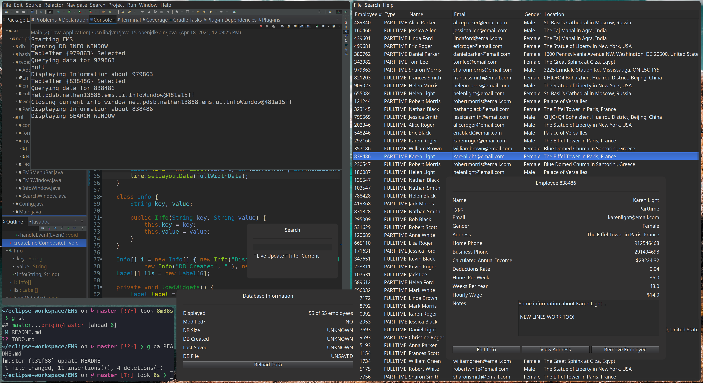

# MyEMS

An EMS software made in Java with SWT and JFace.

## Notable Features and Improvements
- GUI made with the SWT library
- Standardized components with JFace
- Object-oriented and event-driven design
- Support for additional employee information
- Compact (screen real-estate saving) menus
- Portable database format: JSON-based
- Database information dashboard
- *(other thoughtful quirks)...*

## Screenshots
*Random...*

